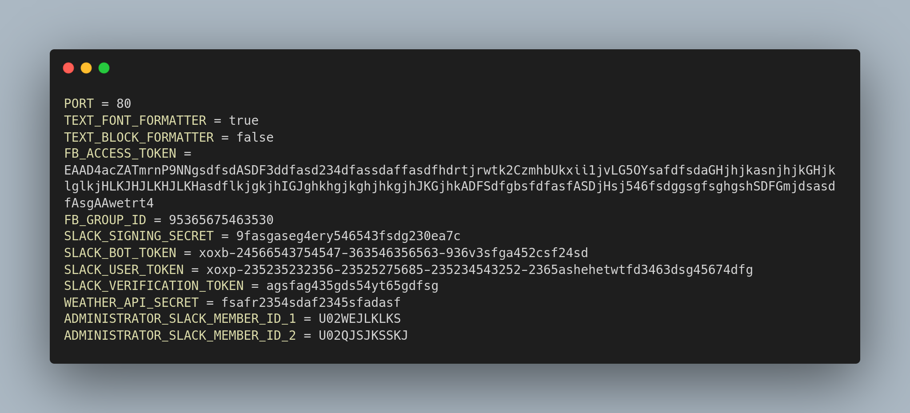
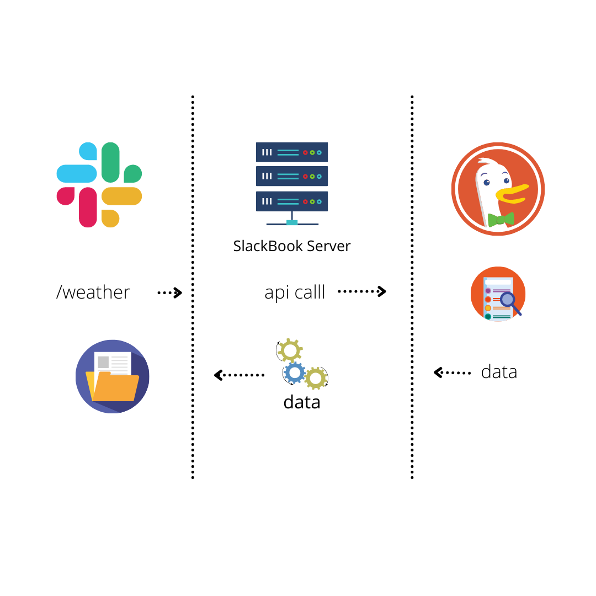
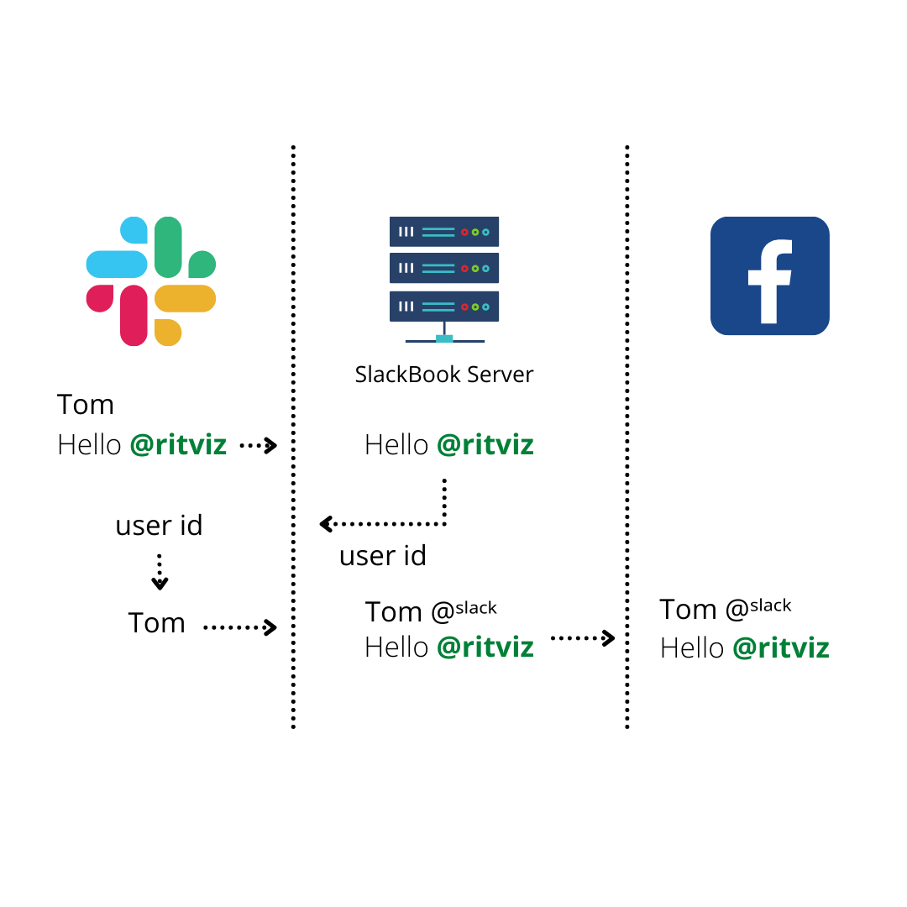

# SlackBook

This is the server for SlackBook

# Features

- Can automatically post your slack messages/attachments/media to your organization’s facebook group by a fixed organizational facebook user.

- Can help you with current weather updates and many more according to needs

# Slack App Integration

## Create An Slack App

1. Go to https://api.slack.com/ > Your apps.

2. You will see `You'll need to sign in to your Slack account to create an application` and sign in to your slack account

3. Click on the `create new app` button.

4. You will see a `create an app` dialog. Select `From an app manifest button`.

5. Select your workspace where you want to install the slack app and proceed `Next` .

6. Edit this [manifest.yaml](./documentation/slackManifest.md) according to your needs, copy and paste, then proceed `Next` and `Create` .

## Install Slack App into your workspace

1. Go to install app section > `install to workspace`

2. Grant the permission to the slack app to access your slack workspace.

## Integrate Slack Bot into a public channel

1. Enter into the channel where you want to integrate the bot.

2. Type @name_of_the_bot in message and press enter.

3. You will see `Want to add this person instead?` pop up and press `Add to Channel`.

# Facebook App Integration

## Create A Facebook User

> SlackBook server needs an user token of a facebook user to call facebook graph apis . You can use your own facebook account user token but it is recommended to create an organizational facebook user account. Ex: Cefalo HR . And make sure, your facebook user account is an admin of your respective facebook group where you want to post status through slack.

## Create A Facebook App

1. Go to https://developers.facebook.com/ , sign up as a developer using your desired facebook user.

2. Go to https://developers.facebook.com/apps/create/ , select `None` , proceed `Next`

3. Enter app display name ( Ex: SlackBot), contact email and then click `Create App`

4. Go to your app Settings > Basic , Enter any live valid URL in Privacy Policy ( Ex: `https://www.cefalo.com/en/` and yes, it works ) , click `Save changes` and then switch on to live by toggling development button on top.

5. Now again toggle from live to development.
   

     
 You are thinking what we are actually doing   here, right?

    

   > Facebook doesn't allow users to see posts in development mode posted by graph api in a group, if the user is not a developer, administrator, tester, or analyst of the used facebook app . So we need to switch to live mode. After swtiching on to live mode, we don't have all the permission scopes by default that we get in development mode. We need `publish_to_groups` permission to post in group using graph api. So, either we need to submit privacy policy, business policy and other documents to facebook to review our app and grant us our required permission in live mode, or we could switch back to our development mode to use the permisson scopes we need. But does that solve our first problem? Posts not visible to all users? Yes, it does somehow. After switching once to live mode, you can than switch back to development and stay like this, but now all the posts, attachments, files are visible to all users except direct photos. Still we can post photos as an attachment preview which is visible to all. Is that a facebook bug? Don't know. But it offers us a great deal. Following links will be helpful to know more :

   - [Publish To Groups](https://developers.facebook.com/docs/permissions/reference/publish_to_groups/)
   - [App Review](https://developers.facebook.com/docs/app-review)
   - [Business Verification](https://developers.facebook.com/docs/development/release/business-verification)

   

6. Go to https://developers.facebook.com/tools/explorer/, select your facebook app, click on `Get Token`, selct `Get User Access Token` and grant access.

7. Clink on `Add a Permission` > `Evens Group Pages` > `publish_to_groups` .

8. Click on `Generate Access Token` and grant permission.

9. You will get an access token, but it will be expire in couple of hours. To extend the expire time ( Maximum of 3 months if the facebook user doesn't change password ) click on the **_i_** button on the left side of the access token dialogue > click on `Open in Access token Tool` > scroll down and click on `Extend Access token`.

10. You wil get a long-lived access token for 3 months. Copy and Store it somewhere. It will be needed in SlackBook server to call graph api.

# SlackBook Server Configuration

Clone this repository and host it. The server will be needed some environment variables listed below:

Go to https://api.slack.com/apps > your app . In Basic Information , scroll down and you will get the signing secret and verification secret for your slack app. And in OAuth & Permission, you will get the user token and bot token.

You have already got the facebook user access token at step 10 of `Create A Facebook App`. Go to your facebook group. In url of your group, you will get the id of the group as a like this `23425543523231114`

# Demonstration & Manuals

## Post On Facebook Group
- Enter any of the public channels where bot is integrated or in bot inbox.

- Type any message, include any attachments/links/media . Just make sure to add `#fbpost` keyword anywhere of your message to post on facebook group.

- Send your message on slack in check it on facebook group !

## Get Weather Update
- Enter any public/private inbox in your workspace. 

- Type `/weather` and send the message. Don't worry, it will not be treated as a message and nobody will see your message. 

- You will get the current weather update near Cefalo, Dhaka. Even that reply response will be visible only to you.

## Get A Greeting 
- Enter any of the public channels where bot is integrated or in bot inbox.
- Type `greet me` and send the message. Your message will be visible to others too.
- You will get `Hello @your_username!` response from bot which will also be visible by others.

  > This feature was actually implemented to test if the server was live. It can be modified to any other necessary task if needed.

# Data Flow

## Events

According to our manifest.yaml configuration, our Slack Bot will be subsrcibed to message events of public channels and bot inbox. All the messages will be forwarded to our SlackBook server by slack server. Then our SlackBook server will do some processing and post on facebook group.

## Commands

Maybe you want to perform some action/api calls without sending a message in public channel. In this case slack command subscription will help you creating custom commands and perform your desired actions. In our case, we have created a /weather command in our configuration that hits a specific route of our SlackBook server which is responsible for fetching weather data of the current time near Cefalo Bangladesh Limited and send back a formatted response which won't be able to be seen by others.

**/weather command interaction in details :**

## Data Processing:

- **Extract Mention:**  
  
  When a user mention someone in slack workspace and send the message it will comes in SlackBook server in a unformated way. Mentioned message contain some special character and user id but we need user name of that user id , for doing this first we extract the user id using regex and do a method call using this id in slack server after that we will get user name and will replace the user id with this user name.

* **Extract Link (message sent from pc) :**  
   
  When someone send message with link it comes to SlackBook server in unformated way. By using regex we extract all the links and remove those unnecessary character.

* **Extract link(message sent from mobile) :**  
    
  If a user sent message from mobile which contain link it got duplicated when comes to SlackBook server. So here we again need to extract all link and have to replace those pair of link with the single link.

* **Concatenate User Name:**
    
  We post messages from slack workspace to facebook group. In facebook side it's important for user to know which message is from which user. Slack server only send the message to SlackBook server not the user name who actually sent this message in slack workspace. So in SlackBook server we need a method call to the salck server by using the user id for getting the user name. After getting the user name we concatenate it with the messages and post this in facebook.

## Difficulties:

- **Heroku Server Problem:**  
    
  Heroku goes to sleep mode after some time like 1 hour. And it will again active if a request hit the server. The moment request hit the server and the moment server got activated the time distance is more than 3 second. So when the heroku server is in sleep mode and if a user send message, slack server will send this message to SlackBook server, and it will again and again send this message in 3 second time period until it got a ok message from SlackBook server. As heroku need more than 3 second to active from sleep mode so 2-3 same messages will queued in heroku SlackBook server. And all this same messages will post in facebook. Here we solved this problem by using event id of the messages.

 

# Steps To Post Data from Server to Facebook

 

- **Step 1** : Server catches the event passed by slack.

- **Step 2** : It checks whether the event is a **message** type . If it is a message type event system moves to the next step .

- **Step 3** : System checks if the message contains any file .

   

  

  
 If the message doesn’t contain any file  

   

  - **Step 4** : System checks whether the the message contains any link .

    

    
 If it doesn’t contain any link

     

    - **Step 5** : The final step for the system to call the corresponding EndPoint of Facebook API . Credentials to Post a Status without Links and Attachments are :

      <pre>
      
      Method Name: POST
      API Endpoint: https://graph.facebook.com/{group_id}/feed/
      Parameter: message = {message_you_want_to_share}
      Facebook App: SlackBot
      Token Type: User Token
      Access Token : generated access token in graph api explorer in facebook
      Permission Scope :  1. publish_to_groups  2. public_profile 
      
      </pre>

    

     
    

    
If it contains link

     

    - **Step 5** : The final step for the system to call the Corresponding Endpoint of Facebook API .Credentials to Post a Status with Links are :

       <pre>
      
        Method Name: POST
        API Endpoint: https://graph.facebook.com/{group_id}/feed?link={link_you_want_to_share}
        Parameter: message = {message_you_want_to_share}
        Facebook App: SlackBot
        Token Type: User Token
        Access Token : generated access token in graph api explorer in facebook
        Permission Scope :  1. publish_to_groups  2. public_profile 
      
      </pre>

    - **Limitations** : Facebook doesn’t preview more than one link on Facebook . Other Links including the first one will remain in the message as a link but will not be previewd . That’s Why system has to pass the first link in the link parameter but all the links will remain in the message .

       

    

    

     

    

    
 If the message contains any file 

     

    - **Step 4** : System checks how many files are attached with the event . If there are multiple files then system can’t post this on facebook because facebook doesn't allow to post multiple files on facebook . So , If there is only one file then the system will move to next step. Otherwise the system response back `Hello @username!, you can not post multiple files/photos to facebook`

    - **Step 5** : System makes the url of the file public in the slack server. For this system uses a method which takes the user token of slack app and file id of file as arguments .

    - **Step 6** : System checks if the file type is an image .

       

        

        
 If file type is image

         

      - **Step 7** : The final step for the system to call the Corresponding Endpoint of Facebook API .Credentials to Post a Status with photos are
        <pre>
        
        Method Name: POST 
        API Endpoint: https://graph.facebook.com/{group_id}/photos?url={image_link_with_extension} 
        Parameter: message = {message_you_want_to_share}
        Facebook App : SlackBot
        Token Type: User Token
        Access Token : generated access token in graph api explorer in facebook
        Permission Scope :  1. publish_to_groups  2. public_profile 
        
        </pre>

      - **Limitations** : Can not post multiple photos using this endpoint because the parameter **url** takes only one link .

        

         
        

        
If file type is not image

         

      - **Step 7** : The final step for the system is to call the Corresponding Endpoint of Facebook API .Credentials to Post a Status with attachment except photo are :

         <pre>
        
          Method Name: POST
          API Endpoint: https://graph.facebook.com/{group_id}/feed?link={public_link_of_the_file_in_slack_file_server}
          Parameter: message = {message_you_want_to_share}
          Facebook App: SlackBot
          Token Type: User Token
          Access Token : generated access token in graph api explorer in facebook
          Permission Scope :  1. publish_to_groups  2. public_profile 
        
        </pre>

      - **Limitations** : Can not post multiple files because Facebook doesn’t allow to post multiple files .

         

        

        

     

    

    
     

  ## Is there any way to post multiple files ?

  Yes , But in this case the user who wants to post multiple files needs to do some extra work by zipping all the files. Then he can upload the zip file like other files .