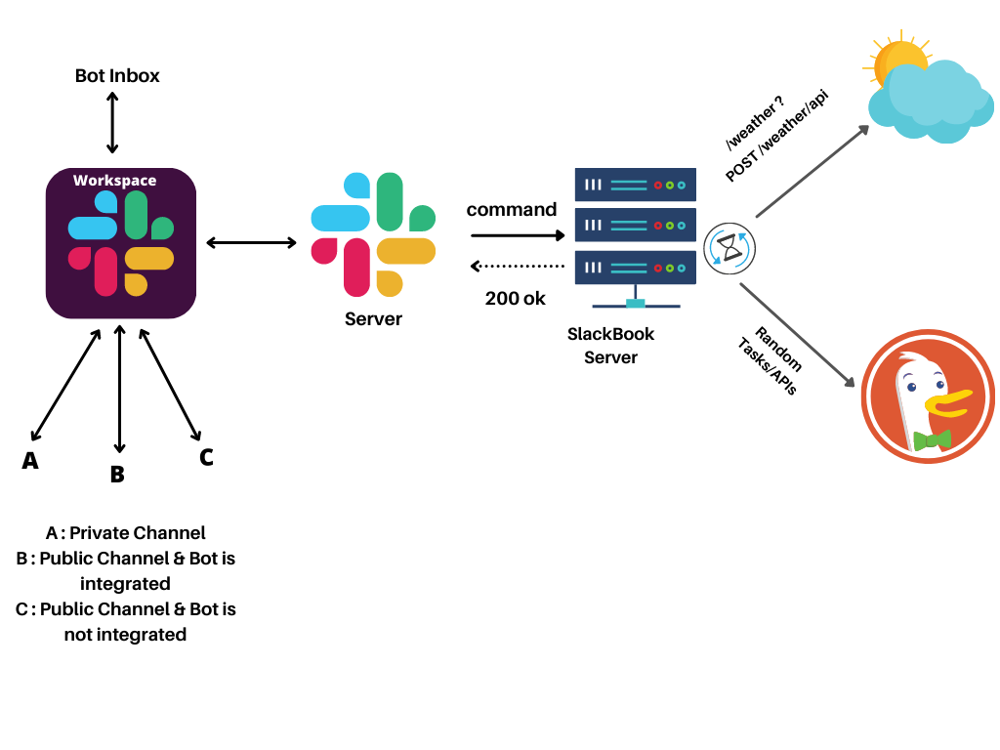
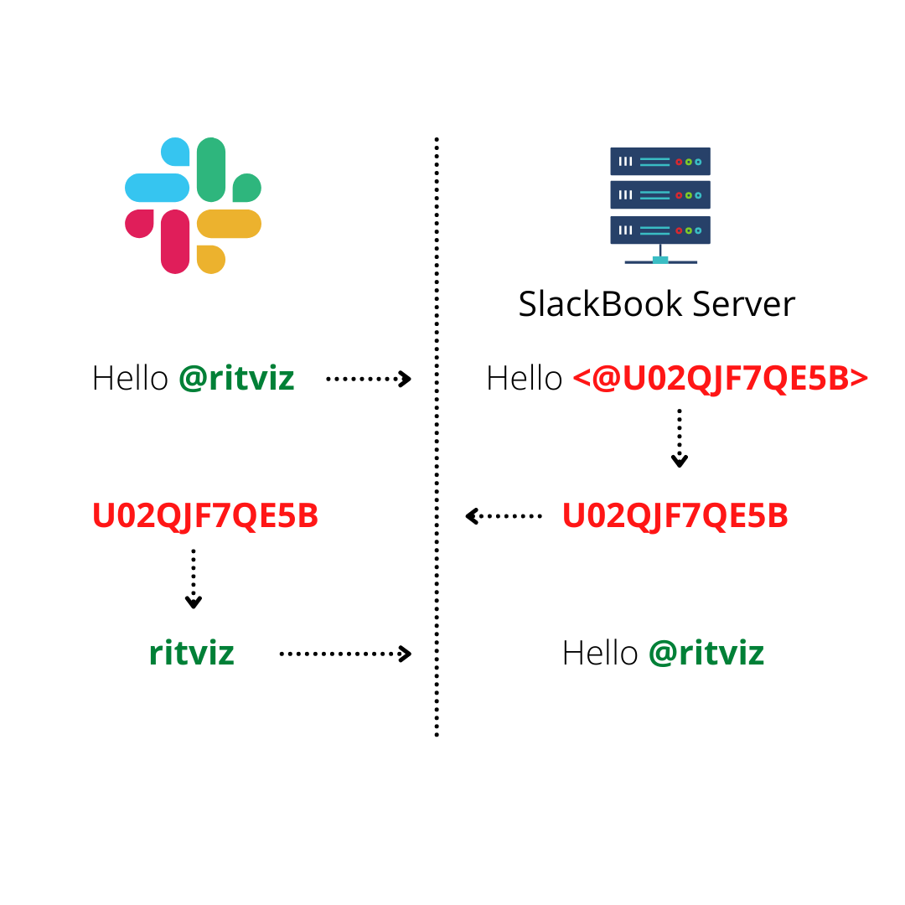
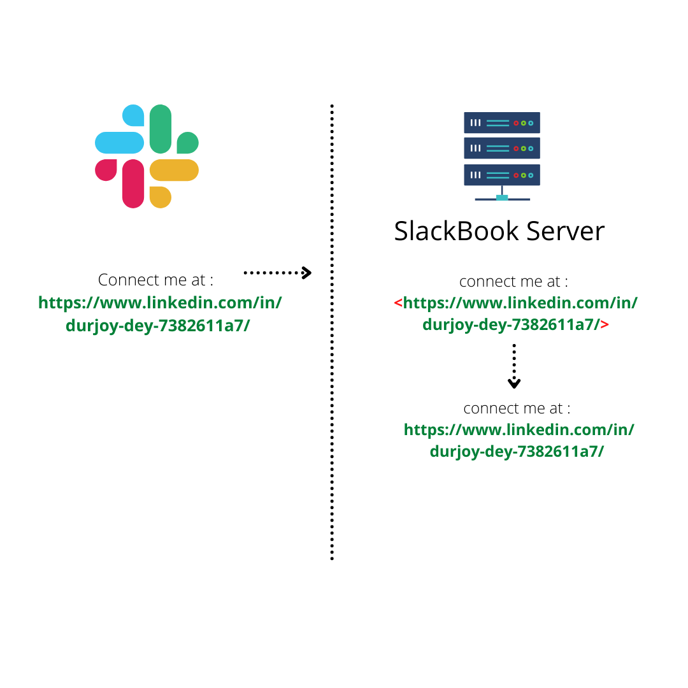
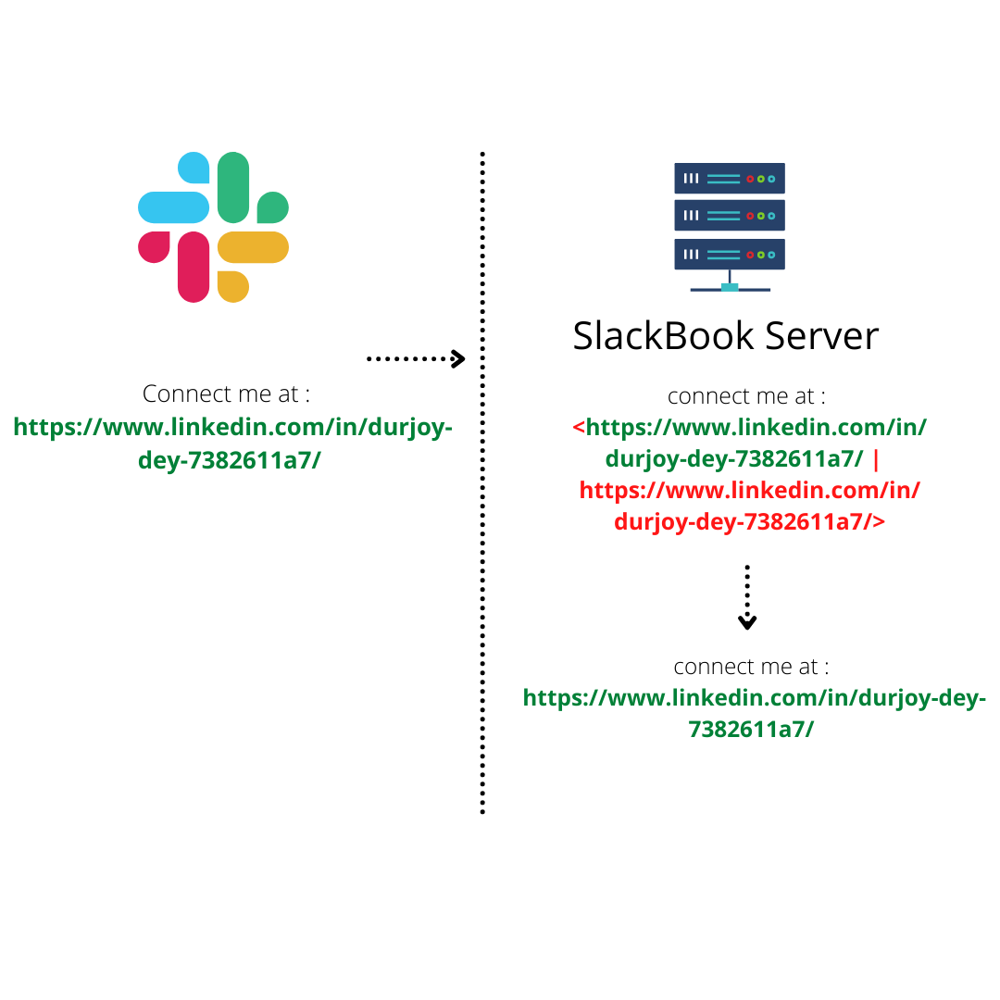
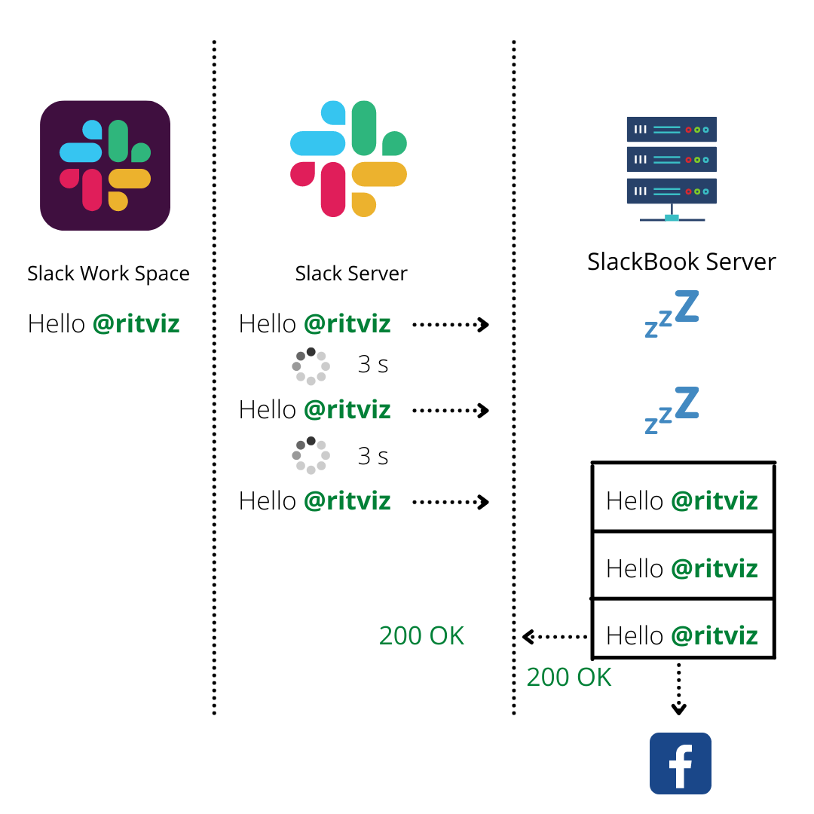
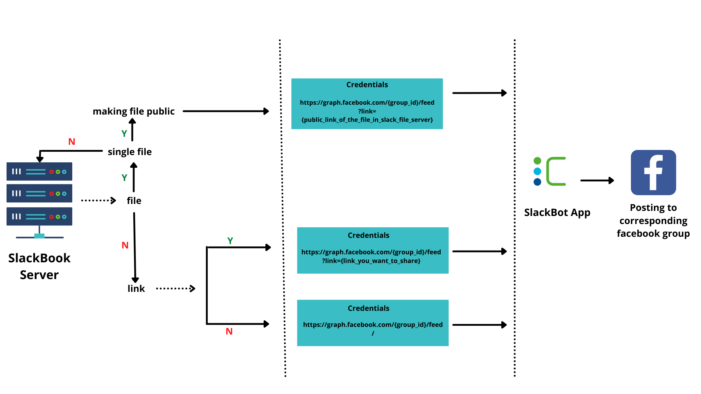

# SlackBook

This is the server for SlackBook

# Features

- Can automatically post your slack messages/attachments/media to your organization’s facebook group by a fixed organizational facebook user.

- Can help you with current weather updates and many more according to needs

# Slack App Integration

## Create An Slack App

1. Go to https://api.slack.com/ > Your apps.

2. You will see `You'll need to sign in to your Slack account to create an application` and sign in to your slack account

3. Click on the `create new app` button.

4. You will see a `create an app` dialog. Select `From an app manifest button`.

5. Select your workspace where you want to install the slack app and proceed `Next` .

6. Edit this [manifest.yaml](./documentation/slackManifest.md) according to your needs, copy and paste, then proceed `Next` and `Create` .

## Install Slack App into your workspace

1. Go to install app section > `install to workspace`

2. Grant the permission to the slack app to access your slack workspace.

## Integrate Slack Bot into a public channel

1. Enter into the channel where you want to integrate the bot.

2. Type @name_of_the_bot in message and press enter.

3. You will see `Want to add this person instead?` pop up and press `Add to Channel`.

# Data Flows

## Events

According to our manifest.yaml configuration, our Slack Bot will be subsrcibed to message events of public channels and bot inbox. All the messages will be forwarded to our SlackBook server by slack server. Then our SlackBook server will do some processing and post on facebook group.

## Commands

Maybe you want to perform some action/api calls without sending a message in public channel. In this case slack command subscription will help you creating custom commands and perform your desired actions. In our case, we have created a /weather command in our configuration that hits a specific route of our SlackBook server which is responsible for fetching weather data of the current time near Cefalo Bangladesh Limited and send back a formatted response which won't be able to be seen by others.

# Difficulties and Limitation

## Difficulties:

- **Mention Extraction :**  
  
  When a user mentioned someone in slack workspace and send the message it will comes in SlackBook server in a unformated way. Mentioned message contain some special character and user id but we need user name of that user id , for doing this first we extract the user id using regex and do a method call using this id in slack server after that we will get user name and will replace the user id with this user name.

* **Extract Link :**  
   
  When someone send message with link it again comes to SlackBook server in unformated way. By using regex we extract all the links and remove those unnecessary character.

* **Extract link(message sent from mobile)**  
    
  If a user sent message from mobile which contain link it got duplicated when comes to SlackBook server. So here we again need to extract all link and have to replace those pair of link with the single link.

* **Heroku Server Problem:**  
    
  Heroku is go to sleep mode after some time like 1 hour. And it will again active if a request hit the server. The moment request hit the server and the moment server got activated the time distance is more than 3 second. So when the heroku server is in sleep mode and if a user send message, slack server will send this message to SlackBook server, and it will again and again send this message in 3 second time period until it got a ok message from SlackBook server. As heroku need more than 3 second to active from sleep mode so 2-3 same messages will queued in heroku SlackBook server. And all this same messages will post in facebook. Here we solve this problem by using event id of the messages.

 

# Process of Posting Data from Server to Facebook

 

- <h2> <a href = "#fbpostwithoutfiles" > Facebook post without files </a> </h2>  
  
    <h3 > <a href = "#fbpostwithoutlink" > 1. Facebook post without link  </a> </h3> 
    <h3 > <a href = "#fbpostwithlink" > 2. Facebook post with link </a> </h3>  

 - <h2> <a href = "#fbpostwithfiles" > Facebook post with files </a> </h2>  
    <h3 > <a href = "#fbpostwithimage" >1. Facebook post with image </a></h3> 
    <h3 > <a href = "#fbpostwithoutimage" >2. Facebook Post with files except image </a> </h3>  

 

### <h3 id = "commonphase" > Common steps in Facebook post with or without files <h3>
 

Expand

 

- System catches the event passed in slack using a slack app called **slackbot**.

- It checks whether the event is a **message** type . If it is a message type event , then system moves to the next step .

  

 

## <h2 id = "fbpostwithoutfiles"> Facebook post without files <h2>

 

### <h3 id = "commonlink"> Common steps in facebook post with or without links </h3>

 

Expand 

 

- Then the system checks if the message contains any file . If the message doesn’t contain any file then the system moves to the next step .

 

 

###  <h3 id = "fbpostwithoutlink"> Facebook post without Link <h3>

 

 Expand 

 

- <a href = "#commonphase"> common steps for facebook post with or without files</a> . These steps are perfomed by the system first . 
- Secondly , system performs this steps . <a href = "#commonlink"> common steps for facebook post with or without links </a>
- Now the system checks whether the text field of the message contains any link . If it doesn’t contain any link, the system moves to the next step.

- Now it’s the final step for the system to call the Corresponding Endpoint of Facebook API . Credentials to Post a Status without Links and Attachments are :

<pre>

  Method Name: POST
  API Endpoint: https://graph.facebook.com/{group_id}/feed/
  Parameter: message = {message_you_want_to_share}
  Facebook App: SlackBot
  Token Type: User Token
  Access Token : generated access token in graph api explorer in facebook
  Permission Scope :  1. publish_to_groups  2. public_profile 

</pre>

 

###  <h3 id = "fbpostwithlink">Facebook post with link <h3>

  

Expand

   

- <a href = "#commonphase"> common steps for facebook post with or without files</a> . These steps are perfomed by the system first. 

- Secondly , system performs this steps . <a href = "#commonlink"> common steps for facebook post with or without links </a>

- Now the system checks whether the text field of the message consists of any link . If it contains any link, the system moves to the next step.

- Now it’s the final step for the system to call the Corresponding Endpoint of Facebook API .Credentials to Post a Status with Links are :

 <pre>

  Method Name: POST
  API Endpoint: https://graph.facebook.com/{group_id}/feed?link={link_you_want_to_share}
  Parameter: message = {message_you_want_to_share}
  Facebook App: SlackBot
  Token Type: User Token
  Access Token : generated access token in graph api explorer in facebook
  Permission Scope :  1. publish_to_groups  2. public_profile 

</pre>

- **Limitations** : Facebook doesn’t allow one user to share more than one link on Facebook . Other Links including the first one will remain in the message as a link but will not be shared . That’s Why systems passess the first link in the link parameter but all the links will remain in the message .

 

 

## <h2 id = "fbpostwithfiles"> Facebook post with files </h2>

 

### <h3 id = "commonimage" > Common steps in facebook post with or without image <h3>

 

 

 Expand 

- Then the system checks if the message contains any file . If the message contains any file then the system moves to the next step .

- Then system checks how many files are attached with the event . If there are multiple files then system can’t post this in facebook because facebook doesn't allow one to post multiple files in facebook . So , If there is only one file then the system will move to next step.

- Now system makes the url of the file in the slack server public . For this system uses a method which takes the user token of bot and file id of file as arguments .
 

 

### <h3 id = "fbpostwithimage"> Facebook post with image <h3>

 

 Expand 

 

- <a href = "#commonphase"> common steps for facebook post with or without files </a> . These steps are perfomed by the system first .

- Then the systems performs these steps . <a href = "#commonimage"> common steps for facebook post with or without image</a>

- Now system checks if the file type is an image . If the file type is image then system moves to the next step.

- System scraps the image url with extension from the public url and saves it .
- Now it’s the final step for the system to call the Corresponding Endpoint of Facebook API .Credentials to Post a Status with photos are :

<pre>

 Method Name: POST 
 API Endpoint: https://graph.facebook.com/{group_id}/photos?url={image_link_with_extension} 
 Parameter: message = {message_you_want_to_share}
 Facebook App : SlackBot
 Token Type: User Token
 Access Token : generated access token in graph api explorer in facebook
 Permission Scope :  1. publish_to_groups  2. public_profile 

</pre>

- **Limitations** : Can not post multiple photos using this endpoint because the parameter **url** takes only one link .

 

 

### <h3 id = "fbpostwithoutimage"> Facebook post with files except image </h3>

 

 

 Expand 

 

- <a href = "#commonphase"> common steps for facebook post with or without files </a> . These steps are perfomed by the system first .

- Then the systems performs these steps . <a href = "#commonimage"> common steps for facebook post with or without image</a>

- Now system checks if the file type is an image . If the file type is not an image then system moves to the next step.

- Now it’s the final step for the system to call the Corresponding Endpoint of Facebook API .Credentials to Post a Status with attachment except photo are :

<pre>
  Method Name: POST 
  API Endpoint: https://graph.facebook.com/{group_id}/feed?link={public_link_of_the_file_in_slack_file_server}
  Parameter: message = {message_you_want_to_share}
  Facebook App: SlackBot
  Token Type: User Token
  Access Token : generated access token in graph api explorer in facebook
  Permission Scope :  1. publish_to_groups  2. public_profile 

</pre>

- **Limitations** : Can not post multiple files because Facebook doesn’t allow one user to post multiple files .

