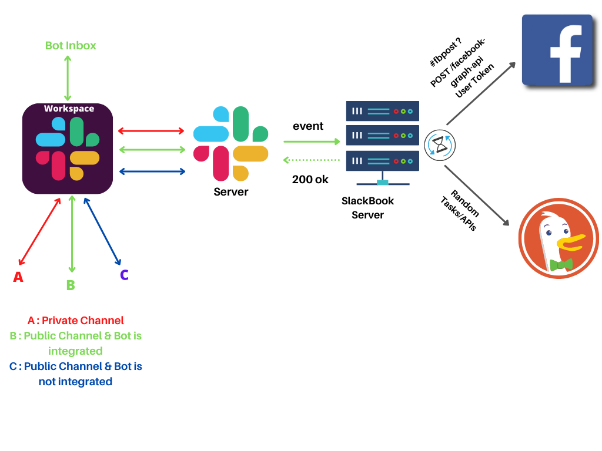

# SlackBook

This is the server for SlackBook  

# Features
-   Can automatically post your slack messages/attachments/media to your organization’s facebook group by a fixed organizational facebook user.

-   Can help you with current weather updates and many more according to needs

# Slack App Integration

## Create An Slack App

1. Go to https://api.slack.com/ > Your apps.

2. You will see `You'll need to sign in to your Slack account to create an application` and sign in to your slack account

3. Click on the `create new app` button.

4. You will see a `create an app` dialog. Select `From an app manifest button`.

5. Select your workspace where you want to install the slack app and proceed `Next` .

6. Edit this [manifest.yaml](./documentation/slackManifest.md) according to your needs, copy and paste, then proceed `Next` and  `Create` .

## Install Slack App into your workspace

1. Go to install app section > `install to workspace`

2. Grant the permission to the slack app to access your slack workspace.

## Integrate Slack Bot into a public channel

1. Enter into the channel where you want to integrate the bot.

2. Type @name_of_the_bot in message and press enter.

3. You will see `Want to add this person instead?` pop up and press `Add to Channel`.

# Data Flows
## Events

According to our manifest.yaml configuration, our Slack Bot will be subsrcibed to message events of public channels and bot inbox. All the messages will be forwarded to our SlackBook server by slack server. Then our SlackBook server will do some processing and post on facebook group. 

## Commands

Maybe you want to perform some action/api calls without sending a message in public channel. In this case slack command subscription will help you creating custom commands and perform your desired actions. In our case, we have created a /weather command in our configuration that hits a specific route of our SlackBook server which is responsible for fetching weather data of the current time near Cefalo Bangladesh Limited and send back a formatted response which won't be able to be seen by others.

# Limitation and Difficulties

## Difficulties:

1.

 

# Process of Posting Data from Server to Facebook
 

## Posting Status without Link and Attachments in Facebook\

 

 - System catches the event passed in slack using a slack app called **slackbot**.

 - It checks whether the event is a **message** type . If it is a message type event , then system moves to the next step .
  
 - Then the system checks if the message contains any file . If the message doesn’t contain any file then the system moves to the next step .         

 - Now the system checks whether the text field of the message contains any link . If it doesn’t contain any link, the system moves to the next step.

- Now it’s the final step for the system to call the Corresponding Endpoint of Facebook API . Credentials to Post a Status without Links and Attachments are : 

<pre>

  Method Name: POST
  API Endpoint: https://graph.facebook.com/{group_id}/feed/
  Parameter: message = {message_you_want_to_share}
  Facebook App: SlackBot
  Token Type: User Token
  Access Token : generated access token in graph api explorer in facebook
  Permission Scope :  1. publish_to_groups  2. public_profile 

</pre>

 

## Posting Status with Links in Facebook
  
   

 - System catches the event passed in slack using a slack app called **slackbot**.

 - It checks whether the event is a **message** type . If it is a message type event , then system moves to the next step .

 - Then the system checks if the message contains any file . If the message doesn’t contain any file then the system moves to the next step .

 - Now the system checks whether the text field of the message consists of any link . If it  contains any link, the system moves to the next step.

 - Now it’s the final step for the system to call the Corresponding Endpoint of Facebook API .Credentials to Post a Status with Links are :

 <pre>

  Method Name: POST
  API Endpoint: https://graph.facebook.com/{group_id}/feed?link={link_you_want_to_share}
  Parameter: message = {message_you_want_to_share}
  Facebook App: SlackBot
  Token Type: User Token
  Access Token : generated access token in graph api explorer in facebook
  Permission Scope :  1. publish_to_groups  2. public_profile 

</pre>

- **Limitations** : Facebook doesn’t allow one user to share more than one link on Facebook . Other Links including  the first one will remain in the message as a link but will not be shared . That’s Why systems passess the first link in the link parameter but all the links will remain in the message .

 

## Posting Status with Photo in Facebook

 

 - System catches the event passed in slack using a slack app called **slackbot**.

 - It checks whether the event is a **message** type . If it is a message type event , then system moves to the next step .

- Then the system checks if the message contains any file . If the message  contains any file then the system moves to the next step .

- Then system checks how many files are attached with the event . If there are multiple files then system can’t post this in facebook because facebook doesn't allow one to post multiple files in facebook . So , If there is only one file then the system will move to next step.

- Now system makes the url of the file  in the slack server public . For this system uses a method which takes the user token of bot and file id of file as arguments .

- Now system checks if the file type is an image . If the file type is image then system moves to the next step.

- System scraps the image url with extension from the public url and saves it .
- Now it’s the final step for the system to call the Corresponding Endpoint of Facebook API .Credentials to Post a Status with photos are :

<pre>

 Method Name: POST 
 API Endpoint: https://graph.facebook.com/{group_id}/photos?url={image_link_with_extension} 
 Parameter: message = {message_you_want_to_share}
 Facebook App : SlackBot
 Token Type: User Token
 Access Token : generated access token in graph api explorer in facebook
 Permission Scope :  1. publish_to_groups  2. public_profile 

</pre>
- **Limitations** : Can not post multiple photos using this endpoint because the parameter **url** takes only one link .

 

## Posting with Attachment Except photo in Facebook

 

 - System catches the event passed in slack using a slack app called **slackbot**.

 - It checks whether the event is a **message** type . If it is a message type event , then system moves to the next step .

- Then the system checks if the message contains any file . If the message  contains any file then the system moves to the next step .

- Then system checks how many files are attached with the event . If there are multiple files then system can’t post this in facebook because facebook doesn't allow one to post multiple files in facebook . So , If there is only one file then the system will move to next step.

- Now system makes the url of the file  in the slack server public . For this system uses a method which takes the user token of bot and file id of file as arguments .

- Now system checks if the file type is an image . If the file type is not an image then system moves to the next step.

- Now it’s the final step for the system to call the Corresponding Endpoint of Facebook API .Credentials to Post a Status with attachment except photo are :

<pre>
  Method Name: POST 
  API Endpoint: https://graph.facebook.com/{group_id}/feed?link={public_link_of_the_file_in_slack_file_server}
  Parameter: message = {message_you_want_to_share}
  Facebook App: SlackBot
  Token Type: User Token
  Access Token : generated access token in graph api explorer in facebook
  Permission Scope :  1. publish_to_groups  2. public_profile 

</pre>
- **limitations** : Can not post multiple files because Facebook doesn’t allow one user to post multiple files .
